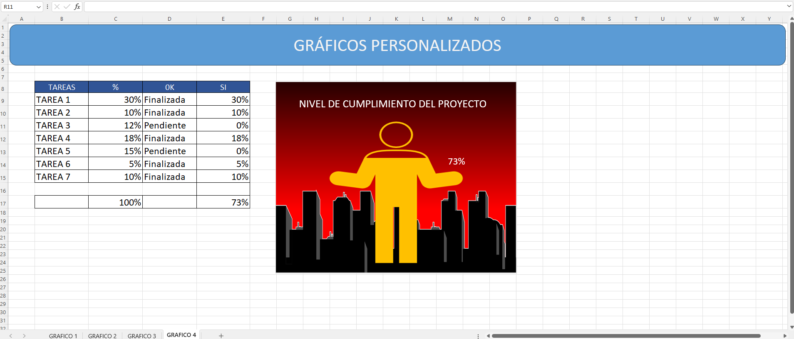

<h1>Gráficos Personalizados en Excel con Iconos Nativos e Imégenes</h1>

Este proyecto muestra cómo crear gráficos personalizados en Excel utilizando los iconos nativos que ofrece la herramienta, junto con un ejemplo especial que incorpora imágenes externas de internet para enriquecer aún más la visualización de datos. El enfoque general es mantener la sencillez, aprovechando al máximo los recursos internos de Excel sin complementos adicionales.
🛠️ ¿Qué incluye este trabajo?

    Visualizaciones interactivas y estéticas usando:

        Iconos de formato condicional.

        Celdas con diseño visual adaptado al contenido.

        Gráficps destacados con iconos nativos de Excel e imágenes sin derechos de autor, degradados y texturas integradas cuidadosamente en el contexto del análisis.

🎯 Objetivo

Demostrar el potencial visual de Excel tanto con sus herramientas nativas como con la integración puntual de imágenes externas para lograr un impacto visual mayor, sin recurrir a programación o macros complejas.
📎 Archivos incluidos

    Archivo .xlsx con todos los gráficos explicados.

🧠 Público objetivo

    Analistas de datos

    Profesionales que elaboran reportes visuales

    Usuarios avanzados de Excel

    Educadores y estudiantes de herramientas de visualización
